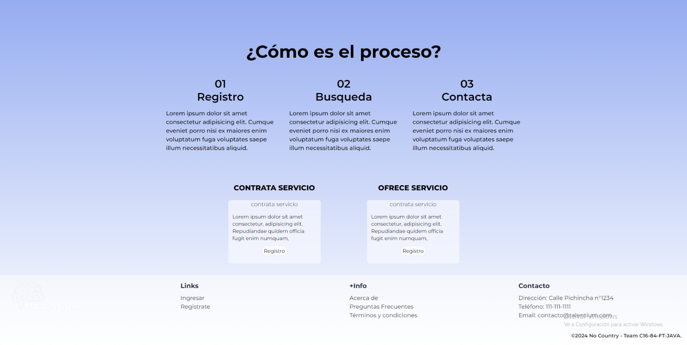
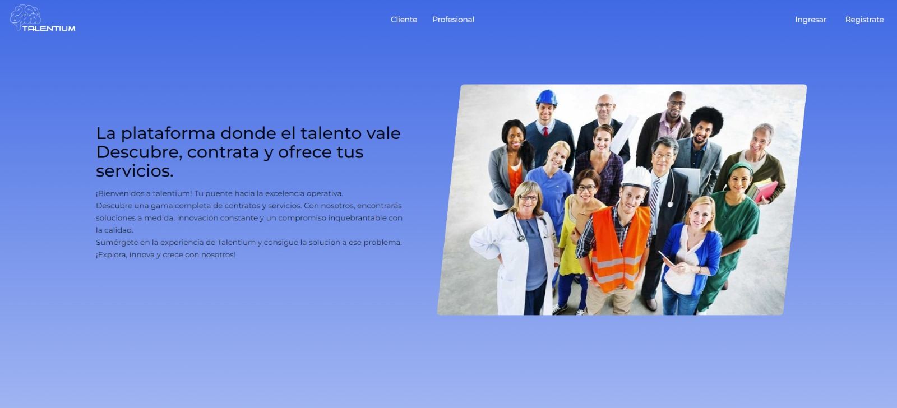
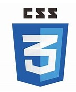
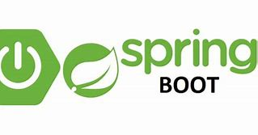
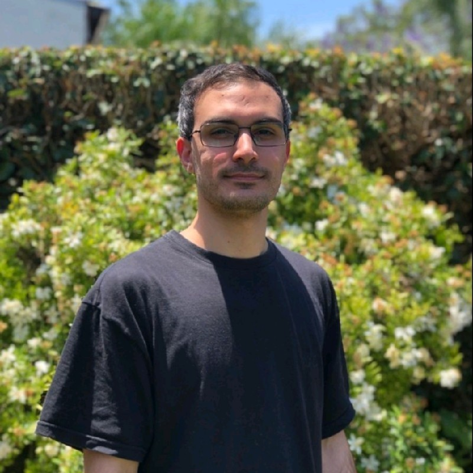
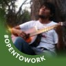
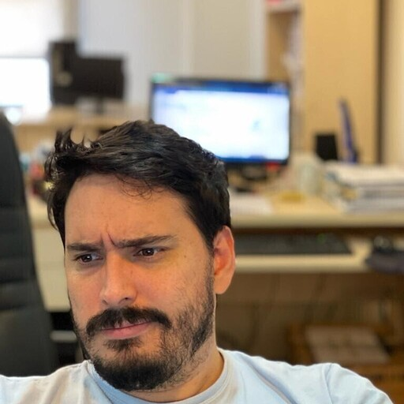
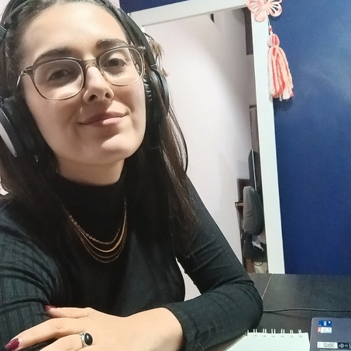

<h1>¡Bienvenido a Talentium!<h1>

#

En nuestra plataforma, podrás conectar con profesionales confiables para satisfacer tus necesidades de manera segura y eficiente. Ya sea que necesites un plomero, un electricista, un diseñador gráfico o cualquier otro servicio, en Talentium encontrarás la solución perfecta.

Regístrate para explorar nuestra plataforma y descubrir todas las posibilidades que ofrecen nuestros talentosos profesionales. Si posees habilidades especiales, también puedes ofrecer tus servicios y ganar dinero extra en tu tiempo libre. ¡Aprovecha al máximo tus talentos y alcanza tus objetivos con Talentium!.

<h3>StartUp tecnológica:</h3>

Regístrate en nuestros servidores de alta seguridad, los cuales garantizan la protección y confidencialidad de tus datos personales. Realiza tus pedidos con total transparencia y tranquilidad, sabiendo que tus necesidades serán atendidas de manera profesional.

Una vez que tu solicitud haya sido completada, puedes expresar tu satisfacción calificando el desempeño del profesional. Todas las transacciones se manejan de forma segura a través de nuestra plataforma de pagos, brindándote la tranquilidad que mereces en cada paso del proceso.

#

#

#

<h3>Tecnologías:</h3>

<h3>Skills</h3>

---

 |  |  > |
 |  :------------: | :------------: | :------------: |
| CSS3  | Tailwind | HTML5  | 

   |  |   |
| :------------: | :------------: | :------------: |  
  REACT  | zustand | Typescript |  

   |  |  |
 | :------------: | :------------: | :------------: | 
|  Java  |  Spring_Boot  |  MYSQL  |

  |  |  |  | 
| :------------: | :------------: | :------------: | :------------: | 
| GIT | GITHUB  | Jira | FIGMA  | 

---

<h3>Reunion Team:</h3>

#

<h3>Equipo:</h3>

#

<table>
<thead>
<tr>

<th align="center">
</th>
<th align="center">
</th>
<th align="center">
</th>
</tr>
</thead>
<tbody>
<tr>
<td align="center"><strong>Mariela Ramirez  </strong></td>
<td align="center"><strong>Brian Lagranda</strong></td>
<td align="center"><strong>Angel Alvarez</strong></td>
</tr>
<tr>
<td align="center"> </td>
<td align="center"> </td>
<td align="center"> </td>
</tr>
</tbody>
</table>
<table>
<thead>
<tr>

<th align="center">
</th>
<th align="center">
</th>
<th align="center">
</th>
</tr>
</thead>
<tbody>
<tr>
<td align="center"><strong>Federico Bazán </strong></td>
<td align="center"><strong>Franco Tallei</strong></td>
<td align="center"><strong>Nicolás Lemos</strong></td>
</tr>
<tr>
<td align="center"> </td>
<td align="center"> </td>
<td align="center"> </td>
</tr>
</tbody>
</table>
<table>
<thead>
<tr>

<th align="center">
</th>
<th align="center">
</th>
<th align="center">
</th>
</tr>
</thead>
<tbody>
<tr>
<td align="center"><strong>Marcos Apodaca </strong></td>
<td align="center"><strong>Lionel Staricoff </strong></td>
<td align="center"><strong>Mario Calderón</strong></td>
</tr>
<tr>
<td align="center"> </td>
<td align="center"> </td>
<td align="center"> </td>
</tr>
</tbody>
</table>
<table>
<thead>
<tr>
<th align="center">
</th>
</tr>
</thead>
<tbody>
<tr>
<td align="center"><strong>Johana Baccei </strong></td>
</tr>
<tr>
<td align="center"><strong> TEAM LEADER </strong></td>
</tr>
</tbody>
</table>

